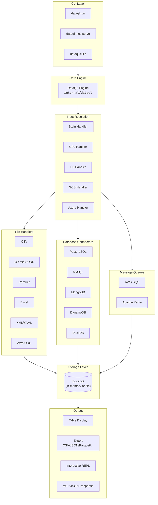
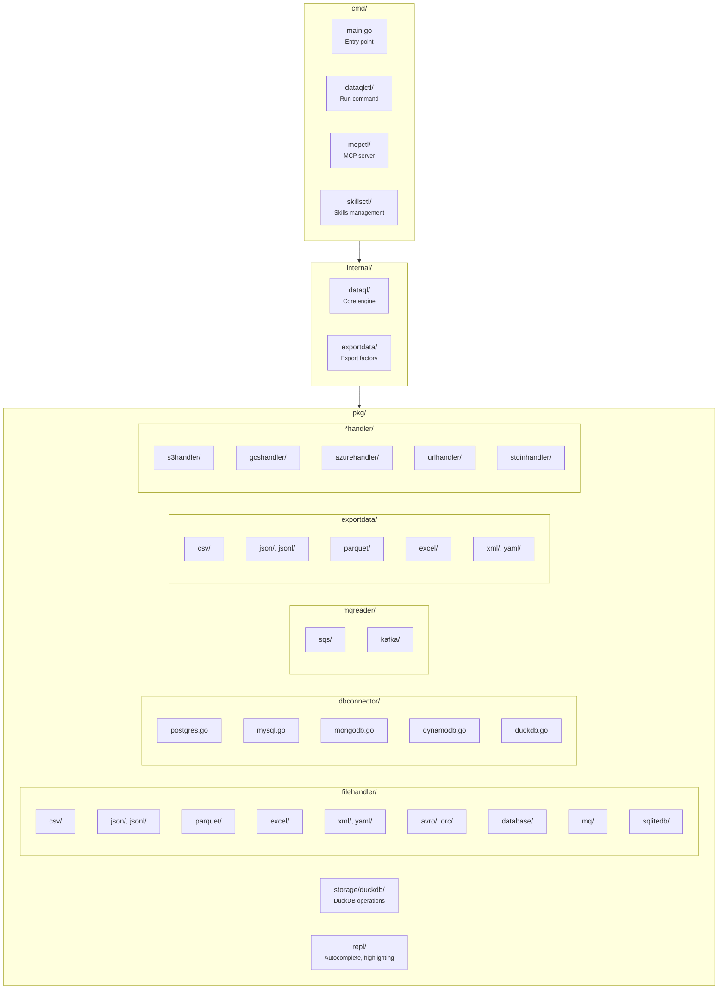
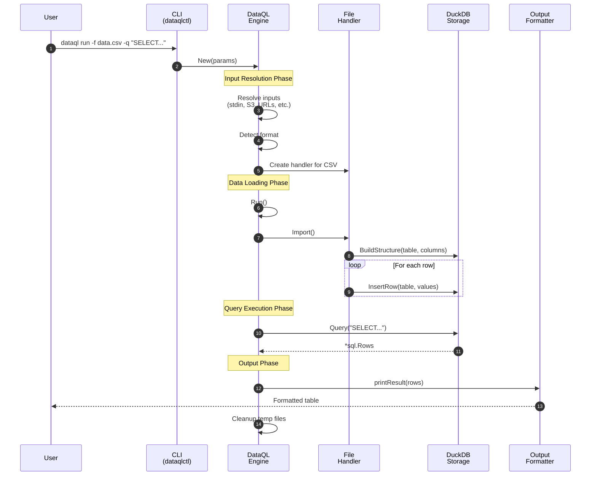
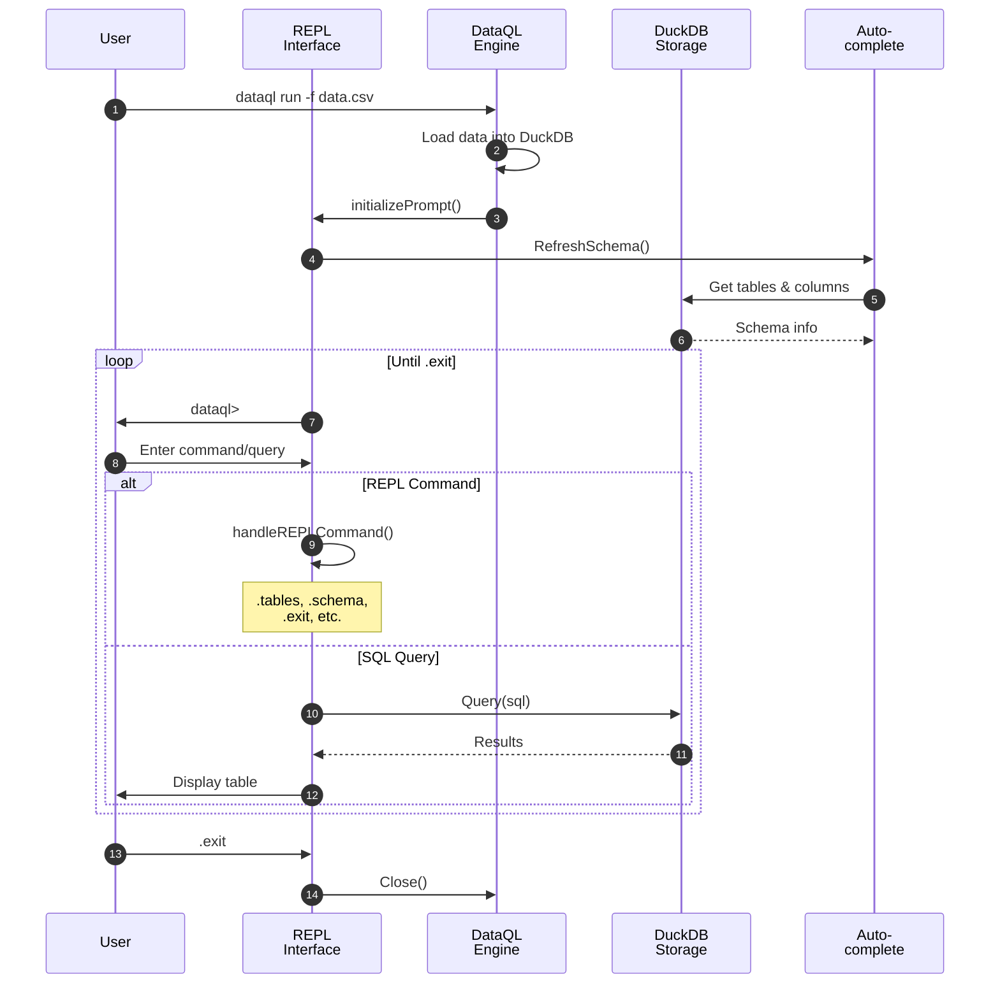
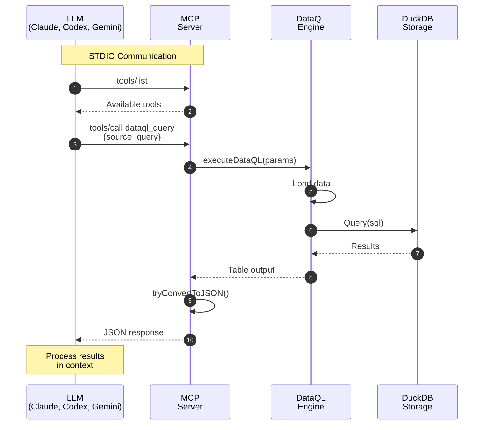

  

# DataQL Architecture

This document provides a comprehensive overview of DataQL's architecture, including system components, data flow, and key operations.

## Table of Contents

- [System Overview](#system-overview)
- [Data Flow](#data-flow)
- [Component Structure](#component-structure)
- [Key Operations](#key-operations)
  - [Query Execution](#query-execution)
  - [Interactive REPL Mode](#interactive-repl-mode)
  - [MCP Server for LLMs](#mcp-server-for-llms)
- [Design Patterns](#design-patterns)
- [Package Reference](#package-reference)

---

## System Overview

DataQL is a CLI tool that enables SQL queries on any data file. The architecture follows a layered design with clear separation of concerns:

### Architecture Highlights

| Layer | Description |
|-------|-------------|
| **CLI Layer** | Entry points for user interaction (run, mcp, skills commands) |
| **Core Engine** | Orchestrates data loading, query execution, and result formatting |
| **Input Resolution** | Resolves remote sources (S3, HTTP, etc.) to local files |
| **File Handlers** | Format-specific data loaders (CSV, JSON, Parquet, etc.) |
| **Database Connectors** | Direct connections to databases (PostgreSQL, MySQL, MongoDB, etc.) |
| **Message Queues** | Peek-mode readers for SQS, Kafka (non-consuming) |
| **Storage Layer** | DuckDB database for SQL query execution |
| **Output** | Result formatting and export functionality |

---

## Data Flow

The data processing pipeline transforms input from any source into queryable SQL tables:

```mermaid
flowchart LR
    subgraph INPUT["1. Input Sources"]
        direction TB
        A1["Local Files"]
        A2["HTTP/HTTPS URLs"]
        A3["S3/GCS/Azure"]
        A4["Databases"]
        A5["Message Queues"]
        A6["Stdin"]
    end

    subgraph RESOLVE["2. Resolution"]
        direction TB
        B1["Download to Temp"]
        B2["Format Detection"]
    end

    subgraph LOAD["3. Loading"]
        direction TB
        C1["FileHandler.Import()"]
        C2["Schema Extraction"]
        C3["Data Transformation"]
    end

    subgraph STORE["4. Storage"]
        direction TB
        D1["CREATE TABLE"]
        D2["INSERT Rows"]
        D3[("DuckDB DB")]
    end

    subgraph QUERY["5. Query"]
        direction TB
        E1["SQL Parsing"]
        E2["Query Execution"]
        E3["Result Set"]
    end

    subgraph OUTPUT["6. Output"]
        direction TB
        F1["Console Table"]
        F2["Export File"]
        F3["MCP JSON"]
    end

    INPUT --> RESOLVE --> LOAD --> STORE --> QUERY --> OUTPUT
```

### Pipeline Stages

1. **Input Sources**: DataQL accepts data from multiple sources:
   - Local files (CSV, JSON, Parquet, Excel, etc.)
   - Remote URLs (HTTP/HTTPS)
   - Cloud storage (S3, GCS, Azure Blob)
   - Databases (PostgreSQL, MySQL, MongoDB, DynamoDB, DuckDB)
   - Message queues (SQS, Kafka - peek mode)
   - Standard input (stdin)

2. **Resolution**: Remote sources are downloaded to temporary files. Format is detected from file extension or URL scheme.

3. **Loading**: The appropriate FileHandler parses the data:
   - Extracts schema (column names and types)
   - Transforms nested structures (JSON flattening)
   - Handles type conversions

4. **Storage**: Data is loaded into DuckDB:
   - Tables created dynamically from schema
   - Column types inferred automatically (BIGINT, DOUBLE, BOOLEAN, VARCHAR)
   - Supports multiple tables for JOINs

5. **Query**: SQL queries are executed against DuckDB:
   - Full DuckDB SQL syntax support (analytical/OLAP optimized)
   - JOINs across multiple data sources
   - Aggregations, filtering, sorting

6. **Output**: Results are formatted for the target:
   - Console table with colors
   - Export to various formats
   - JSON for MCP/LLM integration

---

## Component Structure

The codebase is organized into clear packages with defined responsibilities:

---

## Key Operations

### Query Execution

The standard query flow when running `dataql run -f data.csv -q "SELECT ..."`:

### Interactive REPL Mode

When running DataQL without a query (`dataql run -f data.csv`):

**REPL Commands:**

| Command | Description |
|---------|-------------|
| `.tables`, `\d`, `\dt` | List available tables |
| `.schema <table>` | Show table structure |
| `.count <table>` | Count rows in table |
| `.paging [on\|off]` | Toggle result pagination |
| `.pagesize <n>` | Set page size (default: 25) |
| `.timing [on\|off]` | Show query execution time |
| `.help`, `\h`, `\?` | Show help |
| `.exit`, `\q`, `.quit` | Exit REPL |

### MCP Server for LLMs

When running as an MCP server for LLM integration:

**Available MCP Tools:**

| Tool | Description | Parameters |
|------|-------------|------------|
| `dataql_query` | Execute SQL query | `source`, `query`, `delimiter` |
| `dataql_schema` | Get table schema | `source` |
| `dataql_preview` | Preview first N rows | `source`, `limit` |
| `dataql_aggregate` | Run aggregation | `source`, `column`, `operation`, `group_by` |
| `dataql_mq_peek` | Peek at message queue | `source`, `max_messages`, `query` |

---

## Design Patterns

DataQL employs several design patterns for maintainability and extensibility:

| Pattern | Usage | Example |
|---------|-------|---------|
| **Factory** | Create handlers based on format | `filehandler.NewHandler(format)` |
| **Strategy** | Different import strategies per format | CSV vs JSON vs Parquet handlers |
| **Adapter** | Unified interface for databases | `dbconnector.Connector` interface |
| **Chain of Responsibility** | Input resolution pipeline | stdin → URL → S3 → GCS → Azure |
| **Repository** | Abstract storage operations | `storage.Storage` interface |
| **Command** | REPL command handling | `.tables`, `.schema`, etc. |

---

## Package Reference

| Package | Path | Responsibility |
|---------|------|----------------|
| **CLI Entry** | `cmd/` | Command-line interface and argument parsing |
| **Core Engine** | `internal/dataql/` | Main orchestration and data flow |
| **Export Factory** | `internal/exportdata/` | Route to format-specific exporters |
| **File Handlers** | `pkg/filehandler/` | Format-specific data loading |
| **DB Connectors** | `pkg/dbconnector/` | Database connection and queries |
| **MQ Readers** | `pkg/mqreader/` | Message queue peek operations |
| **DuckDB Storage** | `pkg/storage/duckdb/` | SQL execution and table management |
| **Export Formats** | `pkg/exportdata/` | Format-specific result export |
| **REPL** | `pkg/repl/` | Autocomplete and syntax highlighting |
| **Cloud Handlers** | `pkg/*handler/` | S3, GCS, Azure, URL, stdin handlers |

---

## Supported Formats

### Input Formats

| Category | Formats |
|----------|---------|
| **Files** | CSV, JSON, JSONL, XML, YAML, Parquet, Excel (.xlsx, .xls), Avro, ORC, SQLite |
| **Databases** | PostgreSQL, MySQL, DuckDB, MongoDB, DynamoDB |
| **Cloud Storage** | Amazon S3, Google Cloud Storage, Azure Blob Storage |
| **Message Queues** | AWS SQS, Apache Kafka (peek mode - non-consuming) |
| **Other** | HTTP/HTTPS URLs, Standard input (stdin) |

### Export Formats

CSV, JSON, JSONL, Excel (.xlsx), Parquet, XML, YAML

---

## See Also

- [Getting Started](getting-started.md) - Quick start guide
- [CLI Reference](cli-reference.md) - Complete command reference
- [Data Sources](data-sources.md) - Working with various data sources
- [Database Connections](databases.md) - Database connector details
- [MCP Server Setup](mcp-setup.md) - LLM integration guide
